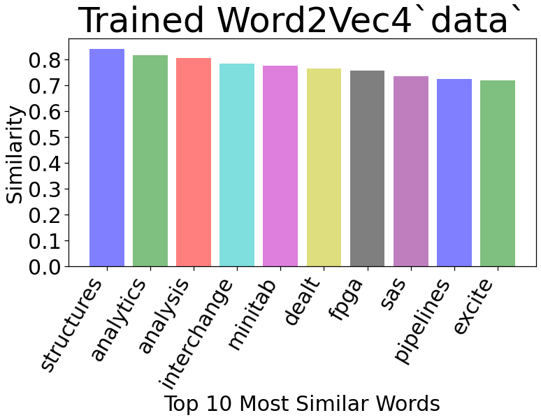
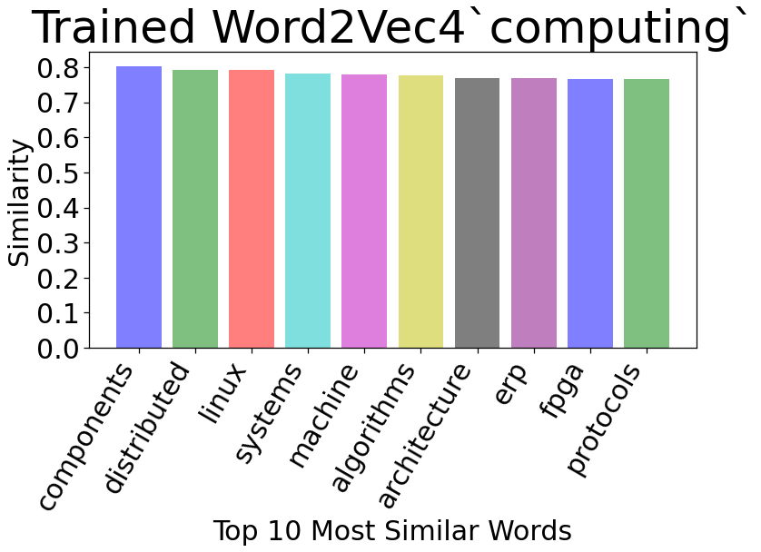
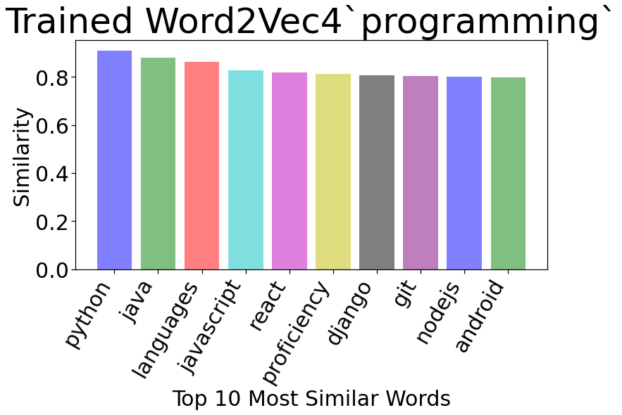
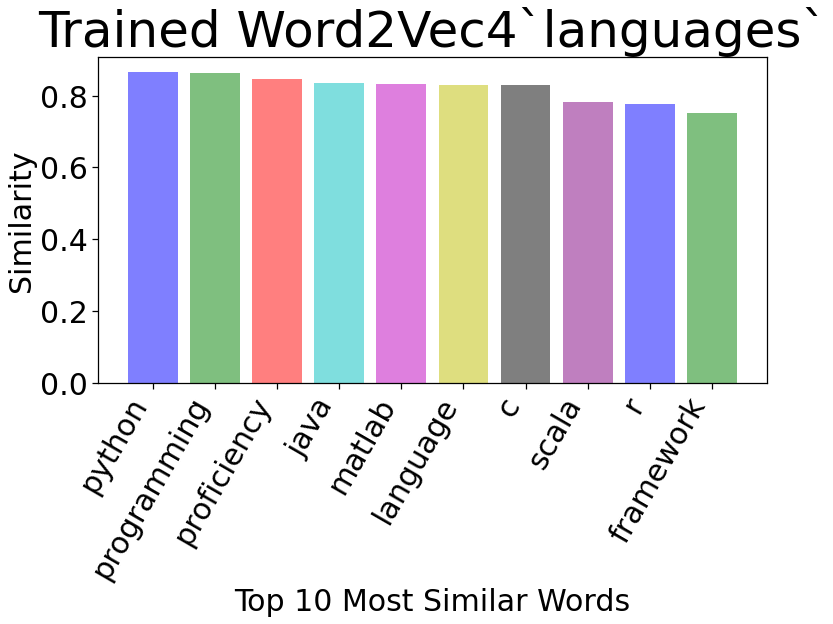
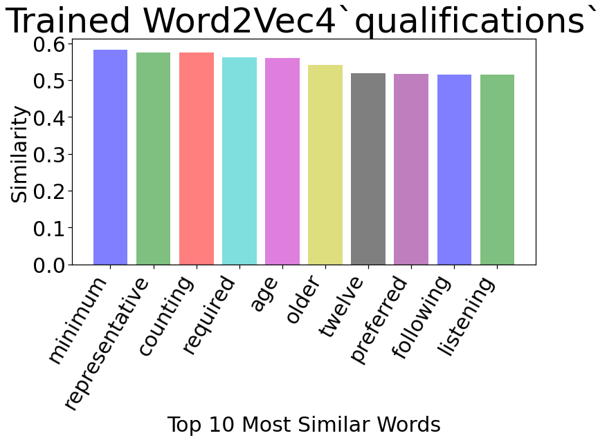
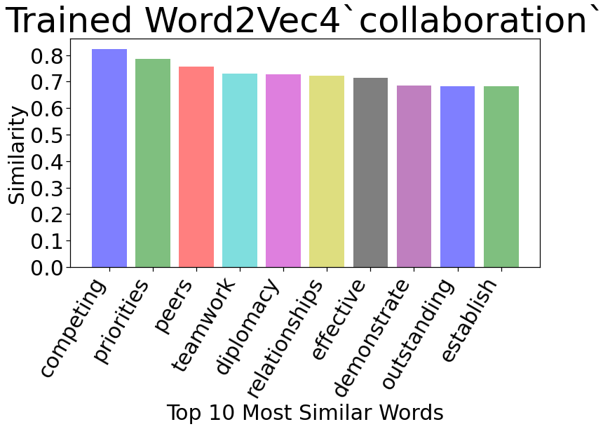
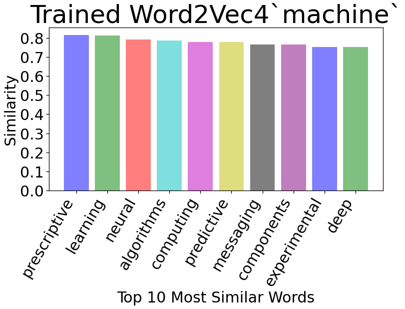
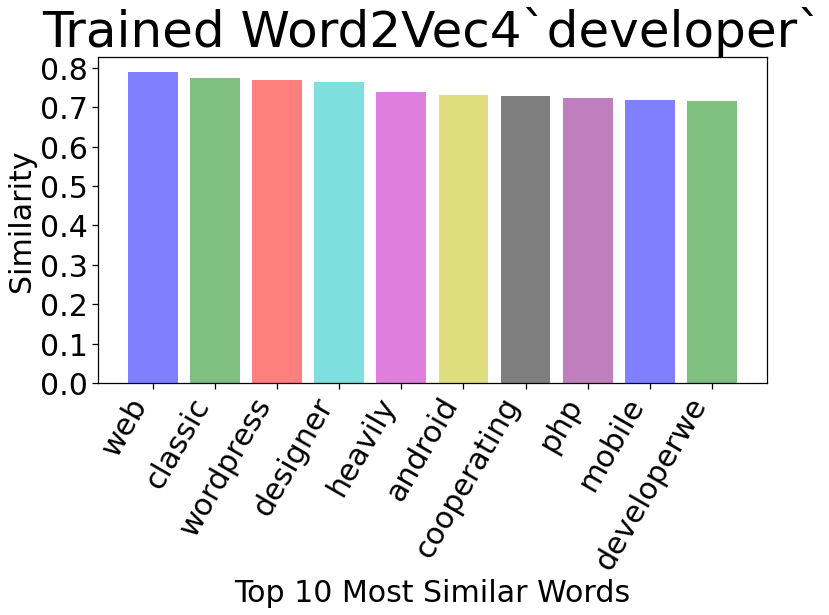
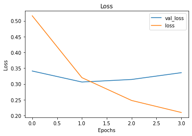
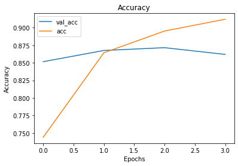

# Job-Posting-Big-Data

## Introduction

This project utilized the [web interface](https://index.commoncrawl.org/) to quickly check what's in there. Afterward, we downloaded common crawl `indices` via [cdx_toolkit](https://github.com/cocrawler/cdx_toolkit/) and/or [HTTP requests](https://pypi.org/project/requests/) from either the command line or Python codes, in which we fetched common crawl cURL `contents` to customize usecases via iterating over a series of cdx-associated objects ([warcio](https://pypi.org/project/warcio/https://pypi.org/project/warcio/)) using [beautiful soup](https://pypi.org/project/beautifulsoup4/), [html2text](https://pypi.org/project/html2text/), [markdown](https://pypi.org/project/Markdown/) and [mistletoe](https://github.com/miyuchina/mistletoe). There are other tools as well such as the [CDX Index Client](https://github.com/ikreymer/cdx-index-client/) for both command line use and [comcrawl](https://pypi.org/project/comcrawl/) in Python. They, however, seem less flexible than the primary option as mentioned previously to be in use for this project.

## Questions:

### 7/ Qualifications and Certifications
Q: What are the top three qualifications or certifications requested by employers?

#### TF-IDF & t-SNE

In this analysis, we worked with almost 100k different documents, each containing one single job AD. Prior to analyzing every single file, we needed to begin by pre-processing and cleaning our text data. Every Natural Language Processing (NLP) task requires the data be tokenized along with the use of regular expression. TF-IDF stands for Term Frequency, Inverse Document Frequency. TF-IDF weighs each term in a document by how unique it is to the given document, which allows us to summarize the contents of a document using a few key words. To visualize TF-IDF vectorization, we make use of a technique called t-SNE (short for t-Stochastic Neighbour Embedding). Both graphs show a basic trend among red and blue dots. In these two graphs, we see a separation between blue/red groups in which one contains selected key words but the other doesn't. This means that the elements of each group vector with the highest values will be the ones that have words that are unique, i.e. selected keywords here, to that specific document, or at least are rarely used in others.

3D t-SNE             | 2D t-SNE
:-------------------------:|:-------------------------:
  |   

#### Normalized Word Frequency 

Machine Learning algorithms don't understand strings. However, they do understand math, which means they understand vectors and matrices. By Vectorizing the text, we just convert the entire text into a vector, where each element in the vector represents a different word. Let's create one frequency distribution by means of tokenizing every single text file. Then, we tried to answer what is the size of the total vocabulary used in every single job ad plain text file. Afterward, we inspected the top 1k most common words. Knowing the frequency with which each word is used is somewhat informative, but without the context of how many words are used in total, it doesn't tell us much. One way we can adjust for this is to use Normalized Word Frequency, which we can compute by dividing each word frequency by the total number of words. 


#### Bi-grams

Knowing individual word frequencies is somewhat informative, but in practice, some of these tokens are actually parts of larger phrases that should be treated as a single unit. So now let's create some bigrams, and see which combinations of words are most telling.


#### Word2Vec Model Training

We created our own word embeddings by making use of the Word2Vec model. Then, we'll move onto building neural networks that make use of Embedding Layers.

* Train a Word2Vec model and transform words into vectors
* Obtain most similar words by using methods associated with word vectors

Now that I have a trained Word2Vec model, go ahead and explore the relationships between some of the words in the corpus! One cool thing I can use Word2Vec for is to get the most similar words to a given word. Here, I tried getting the most similar word to 'qualification'.


qualification              | certification             | experience                | skills
:-------------------------:|:-------------------------:|:-------------------------:|:-------------------------:
        |        |        |  


technologies               | abilities                 | industrial                | degree
:-------------------------:|:-------------------------:|:-------------------------:|:-------------------------:
        |       |       |  


data                       | computing                 | programming               | languages
:-------------------------:|:-------------------------:|:-------------------------:|:-------------------------:
       |       |       |  


qualifications             | collaboration             | machine                   | developer
:-------------------------:|:-------------------------:|:-------------------------:|:-------------------------:
       |       |       |  

#### Machine / Deep Learning NLP Models

In the following, I'll utilize transfer learning, loading in the weights from an open-sourced model that has already been trained for a very long time on a massive amount of data. Specifically, I'll work with the GloVe model from the Stanford NLP Group. There's not really any benefit from training the model ourselves, unless my text uses different, specialized vocabulary that isn't likely to be well represented inside an open-source model.


loss             | accuracy
:-------------------------:|:-------------------------:
  |   


## Prerequisites

Before you begin, ensure you have met the following requirements:
<!--- These are just example requirements. Add, duplicate or remove as required --->
* You have installed the latest version of [anaconda3](https://www.anaconda.com/products/individual)
* You have a `<Windows/Linux/Mac>` machine. 
* You have read a list of links about how to download and manipuate common crawl data as follows:

  - [ccmain starts](https://commoncrawl.org/the-data/get-started/)

  - [ccmain index](https://index.commoncrawl.org/)

  - [ccmain projs](http://commoncrawl.org/the-data/examples/)

  - [ccmain warcs](https://commoncrawl.org/2018/03/index-to-warc-files-and-urls-in-columnar-format/)

  - [search 2021.01](https://index.commoncrawl.org/CC-MAIN-2021-04)

## HTML, CSS, Web Scraping and Beautiful Soup

HTML, or HyperText Markup Language, is a markup language that describes the structure and semantic meaning of web pages. Web browsers, such as Mozilla Firefox, Internet Explorer, and Google Chrome interpret the HTML code and use it to render output. Unlike Python, JavaScript and other programming languages, markup languages like HTML don't have any logic behind them. Instead, they simply surround the content to convey structure and meaning.

HTML lets us mark-up our content with semantic structure. It forms the skeleton of our web page. It would be great to be able to say, "Browser, when we see a `p` tag with `id` of `my-name`, make the first letter be huge!" Or, to get our readers' attention, we might say, "Browser, if you see any tag with a class of warning surround it with a red box!" HTML authors believe that **creating** marked-up documents and **styling** marked-up documents are entirely separate tasks. They see a difference between **writing content** (the data within the HTML document) and specifying presentation, the rules for **displaying** the rendered **elements**.

Browsers combine the content (HTML) and presentation (CSS) layers to display web pages. CSS, or "Cascading Style Sheets," tells us how to write rules that define how browsers will present HTML. Rules in CSS won't look like HTML and they usually live in a file apart from our HTML file. CSS is the language for styling web pages. CSS instructions live apart from the HTML elements and have a different look and feel ("syntax"). CSS directives give web pages their specific look and feel. If you have ever been impressed by how a website can be displayed on a desktop browser while the same content looks great on a mobile device, you have CSS to thank for it!

Web pages can be represented by the objects that comprise their structure and content. This representation is known as the Document Object Model (DOM).  The purpose of the DOM is to provide an interface for programs to change the structure, style, and content of web pages. The DOM represents the document as nodes and objects. Amongst other things, this allows programming languages to interactively change the page and HTML!

Beautiful Soup is a Python library designed for quick scraping projects. It allows us to select and navigate the tree-like structure of HTML documents, searching for particular tags, attributes or ids. It also allows us to then further traverse the HTML documents through relations like children or siblings. In other words, with Beautiful Soup, we could first select a specific div tag and then search through all of its nested tags. With the help of Beautiful Soup, we can:

* Navigate HTML documents using Beautiful Soup's children and sibling relations
* Select specific elements from HTML using Beautiful Soup
* Use regular expressions to extract items with a certain pattern within Beautiful Soup
* Determine the pagination scheme of a website and scrape multiple pages
* Identify and scrape images from a web page
* Save images from the web as well as display them in a Pandas DataFrame for easy perusal

## API, Client-Server Model and HTTP Request/Response Cycle

**APIs** (short for **Application Programming Interfaces**) are an important aspect of the modern internet. APIs are what allows everything on the internet to play nicely with each other and work together. An API is a communication protocol between 2 software systems. It describes the mechanism through which if one system **requests** some information using a predefined format, a remote system **responds** with an outcome that gets sent back to the first system.

APIs are a way of allowing 2 applications to interact with each other. This is an incredibly common task in modern web-based programs. For instance, if you've ever connected your facebook profile to another service such as Spotify or Instagram, this is done through APIs. An API represents a way for 2 pieces of software to interact with one another. Under the hood, the actual request and response is done as an **HTTP Request**. The following diagram shows the HTTP Request/Response Cycle: 

### Web Applications

A Web application (Web app) is an application program that is stored on a remote server and delivered over the Internet through a browser interface. Web services are Web apps by definition and many, although not all, websites contain Web apps. Any website component that performs some function for the user qualifies as a Web app. Google’s search engine is a web app, yet its root concept is hardly different from a phone directory that enables you to search for names or numbers.

Most web apps actually use a browser interface for interaction, i.e. end users request access and request information/service from these applications through a modern web browser interface. There are hundreds of ways to build and configure a Web application but most of them follow the same basic structure: a web client, a web server, and a database.

### Web Clients

The client is what the end user interacts with. "Client-side" code is actually responsible for most of what a user actually sees. For `requesting` some information as a web page, the client side may be responsible for: includes:

* Defining the structure of the Web page
* Setting the look and feel of the Web page
* Implementing a mechanism for responding to user interactions (clicking buttons, entering text, etc.)

Most of these tasks are managed by HTML/CSS/JavaScript-like technologies to structure the information, style of the page and provide interactive objects for navigation and focus.

### Web Servers

A web server in a Web application is what *listens to requests* coming in from the clients. When you set up an HTTP (HyperText Transfer Protocol - Language of the internet) server, we set it up to *listen to a port number*. A port number is always associated with the IP address of a computer. You can think of ports as separate channels on a computer that we can use to perform different tasks: one port could be surfing www.facebook.com while another fetches your email. This is possible because each of the applications (the Web browser and the email client) use different port numbers.

Once you've set up an HTTP server to listen to a specific port, the server waits for client requests coming to that specific port. After authenticating the client, the server performs any actions stated by the request and sends any requested data via an HTTP response.

### Web Databases

Databases are the foundations of Web architecture. An SQL/NoSQL or a similar type of database is a place to store information so that it can easily be accessed, managed, and updated. If you're building a social media site, for example, you might use a database to store information about your users, posts, comments, etc. When a visitor requests a page, the data inserted into the page comes from the site's database, allowing real-time user interactions with sites like Facebook or apps like Gmail. 

In the example image above, we can see the above-mentioned setup in action. A browser sends a request to a web server by calling its domain i.e. www.google.com. Based on who the requester is, the server collects necessary information for an SQL database. This information is wrapped as HTML code and sent back to the client. The web browser reads the structuring and styling information embedded within HTML and displays the page to the user accordingly.

When developing a Web application, the request/response cycle is a useful guide to see how all the components of the app fit together. The request/response cycle traces how a user's request flows through the app. Understanding the request/response cycle is helpful to figure out which files to edit when developing an app (and where to look when things aren't working).

## Installing Softwares

Prior to running `Job-Posting-Big-Data`, please go through a recommendation list of following softwares for the further installation as demanded :

### Anaconda 3

Linux: [follow me](https://docs.anaconda.com/anaconda/install/linux/)

macOS: [follow me](https://docs.anaconda.com/anaconda/install/mac-os/)

Windows: [follow me](https://docs.anaconda.com/anaconda/install/windows/)

### Common Crawl Capture Index

#### Using the Web Interface

* common crawl index server [here](https://index.commoncrawl.org/)
* Jan 2021 index info page [here](https://index.commoncrawl.org/CC-MAIN-2021-04)

#### CDX Toolkit

* common crawl index search toolkit [here](https://github.com/cocrawler/cdx_toolkit/)

```
python -m pip install cdx_toolkit.
```

  - CDX Toolkit in the Command Line

    + Web Archive content [here](https://github.com/webrecorder/warcio)

    ```
    pip install warcio
    ```

  - CDX Toolkit in Python

#### Using the index directly

* CDX index API client [here](https://github.com/ikreymer/cdx-index-client/)
* CDX server API [here](https://github.com/webrecorder/pywb/wiki/CDX-Server-API)
* pywb [here](https://github.com/webrecorder/pywb)

  - Getting the available collections
  - Simple CDX Query
  - Adding filters and options
  - Handling zero results
  - Dealing with Pagination
  - Retrieving Content

#### Searching HTML with BeautifulSoup

* beautiful soup [here](https://www.crummy.com/software/BeautifulSoup/)
* html5 parser [here](https://html5-parser.readthedocs.io/en/latest/)
* html2text [here](https://pypi.org/project/html2text/)

```
python -m pip install html2text
```

* mistletoe [here](https://github.com/miyuchina/mistletoe)

```
python -m pip install mistletoe
```

#### Searching and fetching with Python and comcrawl (Optional)

* comcrawl [here](https://github.com/michaelharms/comcrawl)

```
python -m pip install commcrawl
```

### Machine Learning Models

* Word2Vec [white-paper](https://papers.nips.cc/paper/2013/file/9aa42b31882ec039965f3c4923ce901b-Paper.pdf) / [gensim](https://radimrehurek.com/gensim/index.html#install)

```
pip install -U gensim
```

* TensorFlow-keras [keras-API](https://keras.io/api/)

```
pip install tensorflow
```

```
pip install keras
```

## Using <project_name>

To use <project_name>, follow these steps:

```
<usage_example>
```

Add run commands and examples you think users will find useful. Provide an options reference for bonus points!

## Contributing to <project_name>
<!--- If your README is long or you have some specific process or steps you want contributors to follow, consider creating a separate CONTRIBUTING.md file--->
To contribute to <project_name>, follow these steps:

1. Fork this repository.
2. Create a branch: `git checkout -b <branch_name>`.
3. Make your changes and commit them: `git commit -m '<commit_message>'`
4. Push to the original branch: `git push origin <project_name>/<location>`
5. Create the pull request.

Alternatively see the GitHub documentation on [creating a pull request](https://help.github.com/en/github/collaborating-with-issues-and-pull-requests/creating-a-pull-request).

## Contributors

Thanks to the following people who have contributed to this project:

* [@scottydocs](https://github.com/scottydocs) 📖
* [@cainwatson](https://github.com/cainwatson) 🐛
* [@calchuchesta](https://github.com/calchuchesta) 🐛

You might want to consider using something like the [All Contributors](https://github.com/all-contributors/all-contributors) specification and its [emoji key](https://allcontributors.org/docs/en/emoji-key).

## Contact

If you want to contact me you can reach me at <your_email@address.com>.
